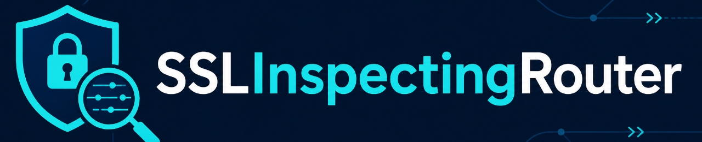
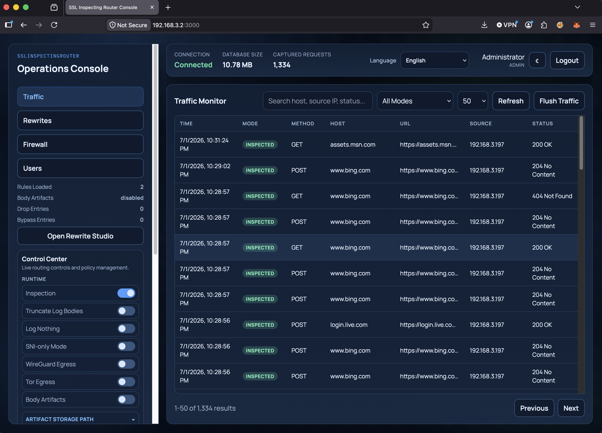

A transparent interception proxy for HTTP and HTTPS traffic on Linux. It redirects traffic with iptables NAT, intercepts it locally for inspection, logging, and optional content modification.

## Features

- Transparent HTTP/HTTPS interception with iptables NAT
- **Dual-NIC gateway mode** — pin LAN ingress and WAN MASQUERADE via `-lan` / `-wan`
- TLS MITM with dynamically generated per-host certificates
- **SNI-only mode** — passive observation without decryption
- SQLite traffic logging with full request/response capture
- Web dashboard with realtime traffic view, policy management, and runtime controls
- WireGuard and Tor egress (runtime toggleable, mutually exclusive)
- JSON-driven response rewrites
- PCAP export of decrypted traffic for Wireshark
- Drop / bypass lists by FQDN, IP, or CIDR; allowlist mode for source IPs
- **Firewall mode** with host-based rules and an iptables-enforced **outbound port allowlist** (default: HTTPS + DNS)



> **⚠️ Security:** This tool performs TLS interception by default. Use it only on networks you own and control, and change the default `admin / admin123` credentials before exposing the dashboard.

## Quick Start

```bash
# Ubuntu / Debian
sudo apt install iptables iproute2 golang

# 1. Clone
git clone https://github.com/dmitryporotnikov/SSLInspectingRouter.git
cd SSLInspectingRouter

# 2. Build (no host changes yet)
go build -o sslinspectingrouter ./cmd/router

# 3. Run (root required for iptables, forwarding, interception)
sudo ./sslinspectingrouter -web :3000

# 4. Open the dashboard
# http://<router-ip>:3000  ·  default admin / admin123
```

For first-time setup with full dependency checks, use `sudo ./scripts/setup.sh`.

## Documentation

| Topic | Where |
| --- | --- |
| Architecture, iptables chains, MITM flow, shutdown | [documentation/how-it-works.md](documentation/how-it-works.md) |
| Every CLI flag and env var | [documentation/cli.md](documentation/cli.md) |
| Dashboard auth, control center, runtime toggles | [documentation/dashboard.md](documentation/dashboard.md) |
| **SNI-only mode** (no-MITM passive observation) | [documentation/snionly.md](documentation/snionly.md) |
| WireGuard and Tor egress | [documentation/egress.md](documentation/egress.md) |
| Logging modes, body artifacts, PCAP, DB schema | [documentation/logging.md](documentation/logging.md) |
| API reference, status payload, error codes | [documentation/api.md](documentation/api.md) |
| Security checklist and limitations | [documentation/security.md](documentation/security.md) |
| Troubleshooting recipes | [documentation/troubleshooting.md](documentation/troubleshooting.md) |
| Response rewrites | [rewrites/README.md](rewrites/README.md) |
| Localization | [LOCALIZATION_CONTRIBUTING.md](LOCALIZATION_CONTRIBUTING.md) |
| Contributing | [documentation/contributing.md](documentation/contributing.md) |

## A 30-second tour of the modes

| Mode | What happens | Where it's enabled |
| --- | --- | --- |
| Full inspection | MITM HTTPS, log every request/response, apply rewrites. | Default. |
| Bypass | Tunnel specific hosts untouched; log `BYPASSED` marker. | `-bypass` or dashboard policy. |
| Drop | Close the connection on a match. | `-drop` or dashboard policy. |
| Inspection paused | Tunnel everything untouched while you're working on something else. | `Inspection` toggle in dashboard. |
| **SNI-only** | Forward HTTPS unmodified; log only SNI and ClientHello metadata (TLS version, ciphers, ALPN, extensions). | `-snionly` flag or `SNI-only Mode` toggle. |
| Allowlist (inspect-only) | Only inspect traffic from the listed source IPs. | `-inspectonly`. |
| Dual-NIC gateway | Pin LAN ingress and WAN egress; transparent interception only fires for the LAN side. | `-lan <iface>` and/or `-wan <iface>`. |
| Firewall mode (host rules) | Block/bypass/inspect individual hosts at the proxy layer. | Firewall → Rules in the dashboard. |
| Firewall mode (outbound ports) | Restrict forwarded traffic to a default-DROP iptables allowlist (default HTTPS + DNS). | Firewall → Outbound Ports in the dashboard. |

See [documentation/snionly.md](documentation/snionly.md) for a sample log row and the full list of metadata captured.

## License

See [LICENSE](LICENSE).

## Credits

Thanks to [@ankit20012006](https://github.com/ankit20012006) and [@Anand-240](https://github.com/Anand-240) for localization contributions.
