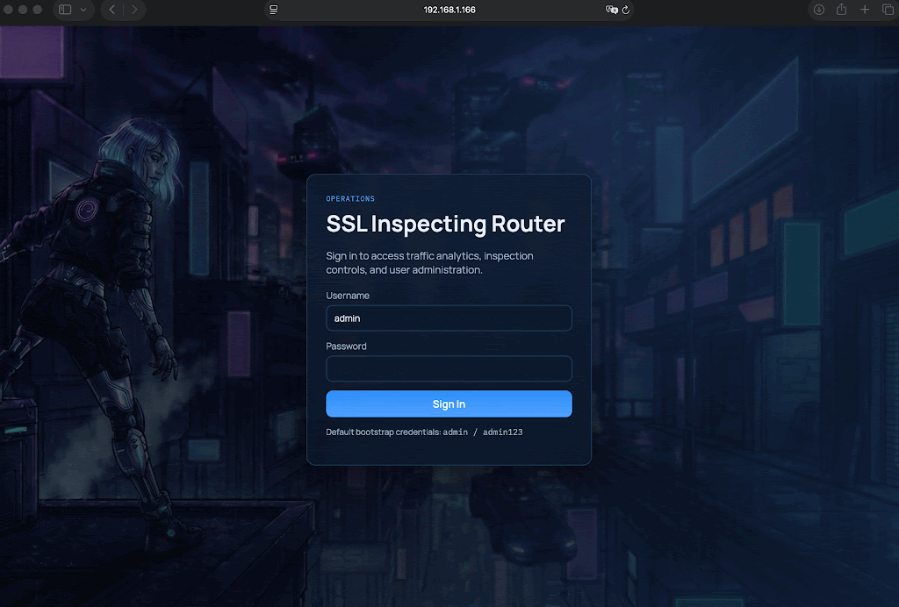

# SSLInspectingRouter


A transparent interception proxy for HTTP and HTTPS traffic on Linux. It redirects traffic using iptables NAT, intercepts it locally for inspection, logging, and optional content modification.

## Extra contributors
Thanks to [@ankit20012006](https://github.com/ankit20012006) and [@Anand-240](https://github.com/Anand-240) for localization contributions.

## Features

- Transparent HTTP/HTTPS interception using iptables NAT
- TLS/SSL MITM with dynamically generated certificates
- SQLite traffic logging with full request/response capture
- Web dashboard for real-time traffic viewing and policy management
- WireGuard egress support (runtime toggleable)
- Tor egress support (runtime toggleable)
- Response rewriting with JSON rules
- PCAP export for Wireshark analysis
- Content blocking by domain, IP, or CIDR
- Allowlist mode to only inspect traffic from specific source IPs

> **⚠️ Security Warning:** This tool performs TLS/SSL interception (MITM). Only use in controlled environments you own. Always change default credentials.

## Quick Start

```bash
# Pre-req:
If you don't have go, install it for your distro. E.g. for Ubuntu - apt install golang

# 1. Clone the repository
git clone https://github.com/dmitryporotnikov/SSLInspectingRouter.git

# 2. Run setup script (enables IP forwarding, checks dependencies)
cd SSLInspectingRouter
sudo ./scripts/setup.sh

# 3. Run the router (requires root)
sudo ./sslinspectingrouter -web :3000

# 4. Access the web dashboard
# Open http://<router-ip>:3000 in your browser
# Default credentials: admin / admin123
```

## Demo



## Table of Contents

- [How It Works](#how-it-works)
- [Build and Initialization](#build-and-initialization)
- [Execution](#execution)
  - [Command Line Arguments](#command-line-arguments)
  - [Web Dashboard Authentication](#web-dashboard-authentication)
  - [WireGuard Egress](#wireguard-egress-web-ui-runtime-toggle)
  - [Tor Egress](#tor-egress-web-ui-runtime-toggle)
  - [Shutdown](#shutdown)
- [Logging](#logging)
- [Response Tampering (Rewrites)](#response-tampering-rewrites)
- [API (v1)](#api-v1)
  - [Database Schema](#database-schema)
- [Security Considerations](#security-considerations)
- [Limitations](#limitations)
- [Troubleshooting](#troubleshooting)
- [Localization](#localization)
- [Contributing](#contributing)

## How It Works

```
+--------+                 +-------------------------+                 +------------+
| Client | <=============> |   SSLInspectingRouter   | <=============> | Destination|
+--------+   (HTTP/HTTPS)  +-------------------------+  (HTTP/HTTPS)   +------------+
              default GW   ^          |          ^           |
                           |          v          |           v
                           |     Decrypt     Re-encrypt      |
                           |                                 |
                           |                                 |
                           |        Inspect & Process        |
                           |                                 |
                           |  - Log to SQLite traffic.db     |
                           |  - Display on Dashboard         |
                           |  - Optional Content Rewrites    |
                           |                                 |
                           +---------------------------------+
                                             |
                                             v
                                        (Optionally)
                                      Export PCAP File
```

Optional egress modes:

* `SSLInspectingRouter -> WireGuard tunnel -> Internet`
* `SSLInspectingRouter -> Tor SOCKS5 -> Internet`

WireGuard and Tor egress are runtime-toggleable from the dashboard, but they are **mutually exclusive** (only one can be enabled at a time).

The application operates by manipulating `iptables` in both `nat` and `filter` tables.
It creates custom chains (`SSLPROXY`, `SSL_DISPATCH`) linked to `PREROUTING` and optional `OUTPUT` hooks to manage transparent redirection:

* **HTTP (Port 80):** Redirected to the local handler on port **8080**.
* **HTTPS (Port 443):** Redirected to the local handler on port **8443**.
* **Additional TLS ports (`-ports`)**: Redirected to the same HTTPS handler on **8443** while preserving the original destination port for upstream forwarding.

To make the Linux host function as an actual gateway, `FirewallManager` also:

* enables IPv4 forwarding (`net.ipv4.ip_forward=1`);
* allows forwarding in `filter/FORWARD` (new + established/related);
* applies `nat/POSTROUTING MASQUERADE` on the detected default egress interface.

This is what allows routed client traffic to pass through the box instead of being blackholed.

Optionally, routed traffic can be sent through a WireGuard client tunnel:

```
Client -> SSLInspectingRouter -> WireGuard tunnel -> Internet
```

This is controlled at runtime from the Web Dashboard Control Center.
As an alternative, upstream proxy egress can be routed through Tor SOCKS5 from the same Control Center.

### SSL/TLS Interception
For encrypted traffic, the proxy acts as a Certificate Authority (CA). It dynamically generates certificates for each host on demand (`cert.go`).
> **Note:** To avoid TLS handshake failures, clients must trust the generated `ca-cert.pem`.

## Build and Initialization

A setup script is provided to automate environment configuration. It enables IPv4 forwarding using `sysctl` and checks for required userspace tools.

Primary validation/testing environment:

```text
DISTRIB_ID=Ubuntu
DISTRIB_RELEASE=24.04
DISTRIB_CODENAME=noble
DISTRIB_DESCRIPTION="Ubuntu 24.04.3 LTS"
```

Common dependencies on Debian/Ubuntu:

* `iptables`
* `iproute2` (provides `ip`)
* `wireguard-tools` (provides `wg-quick`; needed for WireGuard egress mode)
* `tor` (needed for Tor egress mode; default SOCKS endpoint `127.0.0.1:9050`)
* Go compiler (`golang`) - **requires Go 1.21 or later**

To build the project:

```bash
sudo ./scripts/setup.sh
```

If the build is successful, a binary named `sslinspectingrouter` will be created in the project root.

## Execution

**Privileged access (root) is required** for network stack manipulation and interception.

### Basic Usage

Run the binary as the root user:

```bash
sudo ./sslinspectingrouter
```

On the first run, the router generates `ca-cert.pem` and `ca-key.pem`. These are reused on subsequent runs.
The project root also contains a `wireguard/` directory for WireGuard client configs (for example `wireguard/wg0.conf`).

### Command Line Arguments

| Command | Description |
| --- | --- |
| `sudo ./sslinspectingrouter -newcacert` | Force regeneration of the CA certificate and key. |
| `sudo ./sslinspectingrouter -allowquic` | Allow QUIC (UDP/443) traffic. By default, QUIC is blocked to enforce HTTPS over TCP. |
| `sudo ./sslinspectingrouter -ports 8443,9443` | Inspect additional TLS destination ports (comma-separated). Useful for non-standard HTTPS services. |
| `sudo ./sslinspectingrouter -truncatelog` | Truncate request/response bodies in the logs to a 4KB preview (default is full body). |
| `sudo ./sslinspectingrouter -web <addr>` | Start the Web Dashboard on the specified listen address (e.g., `:3000`, `127.0.0.1:3000`). |
| `sudo ./sslinspectingrouter -web :3000 -webtls` | Serve the Web Dashboard over HTTPS with an auto-generated self-signed certificate. |
| `sudo ./sslinspectingrouter -webcert <path> -webkey <path>` | Custom TLS cert/key paths for dashboard HTTPS mode (`-webtls`). |
| `sudo ./sslinspectingrouter -bodyartifacts` | Store binary/compressed HTTP body previews as files for offline inspection. |
| `sudo ./sslinspectingrouter -bodyartifactsdir <path>` | Custom directory for stored body artifacts (default: `logs/body-artifacts`). |
| `sudo ./sslinspectingrouter -wipedb` | Clear only traffic tables (`Requests` / `Responses`) and remove stored body artifacts before startup. Dashboard ACL/auth tables are preserved. |
| `sudo ./sslinspectingrouter -drop <list>` | Drop requests for specific FQDNs, IPs, CIDR (comma-separated). Subdomains are also blocked. |
| `sudo ./sslinspectingrouter -bypass <list>` | Bypass inspection for specific FQDNs (HTTP Host + HTTPS SNI), IPs or CIDRs. Subdomains are also bypassed. Bypassed entries are still logged, but `request` / `response` in SQLite are stored as `BYPASSED`: |
| `sudo ./sslinspectingrouter -inspectonly <IP1,IP2>` | **Allowlist Mode:** Only intercept traffic from the specified source IPs. All other traffic is ignored and bypasses the inspection entirely. |
| `sudo ./sslinspectingrouter -pcap <file>` | Export **decrypted** traffic to a PCAP file readable by Wireshark. Uses synthetic TCP streams to represent the HTTP/HTTPS payloads. |
| `sudo ./sslinspectingrouter -verbose` | Enable verbose application logging to stderr. By default, standard logs are suppressed to keep the console clean. |

### Web Dashboard Authentication

When `-web` is enabled, the dashboard API requires authentication.
When `-webtls` is also enabled, session cookies are marked secure and the dashboard is served over HTTPS.

> **⚠️ Default Credentials Warning:** Change these immediately in production!
> - Username: `admin`
> - Password: `admin123`

Bootstrap admin account (created on first run if no users exist):

Optional environment variables for bootstrap/admin configuration:

* `SIR_ADMIN_USER`
* `SIR_ADMIN_PASS`
* `SIR_ADMIN_NAME`
* `SIR_SESSION_SECRET` (recommended in production)

Optional environment variables for path overrides:

* `SSLINSPECTINGROUTER_REWRITES_DIR`
* `SSLINSPECTINGROUTER_WIREGUARD_DIR`
* `SSLINSPECTINGROUTER_TOR_SOCKS_ADDR` (optional override for Tor SOCKS endpoint)

**Example: Blocking specific domains**

```bash
sudo ./sslinspectingrouter -drop test.com,test2.com
```

*(This will block `test.com`, `www.test.com`, `test2.com`, etc.)*

**Example: Combining multiple parameters**

You can combine multiple flags. For example, to block specific domains, start the web dashboard on `:3000`, and truncate logs:

```bash
sudo ./sslinspectingrouter -drop test.com,test2.com -web :3000 -truncatelog
```

**Example: Inspect non-standard TLS ports**

```bash
sudo ./sslinspectingrouter -ports 8443,9443
```

**Example: Dashboard over HTTPS (self-signed)**

```bash
sudo ./sslinspectingrouter -web :3000 -webtls
```

### WireGuard Egress (Web UI Runtime Toggle)

Use this when you want clients behind the router to reach destinations from a different public IP (for example through a VPS tunnel).

1. Start the router with dashboard enabled:

```bash
sudo ./sslinspectingrouter -web :3000
```

2. Open the dashboard as admin.
3. In `Control Center`:
   * Paste a WireGuard client config in `WireGuard Client Config` and click `Save WireGuard Config`, **or**
   * Place a `.conf` file directly into project `wireguard/` directory.
4. Enable `WireGuard Egress` toggle.

When enabled, the router switches egress NAT to the WireGuard interface so forwarded client traffic and router-originated upstream traffic exit through the tunnel.
Disable the toggle to revert to the original default egress interface.

Notes:

* The Web UI config save writes to `wireguard/wg0.conf`.
* WireGuard egress control requires `wg-quick` and `ip` binaries available on the host.
* WireGuard and Tor egress toggles are mutually exclusive.

### Tor Egress (Web UI Runtime Toggle)

Use this when you want proxy upstream traffic (HTTP + HTTPS, including bypass/inspection-paused tunnels) to exit via Tor.

1. Install and run Tor on the router host (default local SOCKS endpoint is `127.0.0.1:9050`).
2. Start the router with dashboard enabled:

```bash
sudo ./sslinspectingrouter -web :3000
```

3. Open the dashboard as admin.
4. Enable `Tor Egress` toggle.

When enabled, upstream requests are routed through Tor SOCKS5. Disable the toggle to restore direct upstream routing.

Notes:

* Default SOCKS endpoint is `127.0.0.1:9050`.
* Override SOCKS endpoint with `SSLINSPECTINGROUTER_TOR_SOCKS_ADDR`.
* Tor and WireGuard egress toggles are mutually exclusive.

### Shutdown

The application listens for `SIGINT` and `SIGTERM` signals. When received, it initiates a graceful shutdown:

1. Attempts to bring down an active WireGuard tunnel (if enabled).
2. Removes `SSL_DISPATCH` / `SSLPROXY` redirection links and chains from iptables.
3. Removes forwarding/NAT pass-through rules created for gateway mode.

## Logging

Console output displays only the source IP and requested FQDN. Detailed logs are stored in a SQLite database.

* **Log Location:** `logs/traffic.db`
* When inspection is paused from Web UI, tunneled TLS traffic is still routed and logged as `INSPECTION PAUSED` (not `BYPASSED`).
* Binary/compressed payload previews are marked as skipped with detected `Content-Type` / `Content-Encoding` metadata. Optional body artifacts can be enabled via CLI or Web UI for admin inspection.

## Response Tampering (Rewrites)

The router can modify **HTTP and HTTPS responses on the fly** using rewrite rules stored in `rewrites/*.json`.

* **Examples & format:** `rewrites/README.md`
* **Reloading:** rules are auto-reloaded when files change (polling).

## API (v1)

The backend exposes a versioned API under `/api/v1`.

Public endpoints:

* `GET /api/v1/health`
* `POST /api/v1/auth/login`

Authenticated endpoints:

* `POST /api/v1/auth/logout`
* `GET /api/v1/auth/me`
* `GET /api/v1/status`
* `PUT /api/v1/status` (admin)
* `GET /api/v1/policy`
* `PUT /api/v1/policy` (admin)
* `GET /api/v1/traffic`
* `DELETE /api/v1/traffic` (admin, flush captured traffic)
* `GET /api/v1/traffic/{id}`
* `GET /api/v1/rewrites`
* `POST /api/v1/rewrites` (admin)
* `GET /api/v1/rewrites/{id}` (admin-managed rule by index)
* `PUT /api/v1/rewrites/{id}` (admin, managed rules)
* `DELETE /api/v1/rewrites/{id}` (admin, managed rules)
* `GET /api/v1/users` (admin)
* `POST /api/v1/users` (admin)
* `PUT /api/v1/users/{id}` (admin)
* `DELETE /api/v1/users/{id}` (admin)

`PUT /api/v1/status` accepts runtime admin settings:

* `inspection_enabled` (bool)
* `truncate_log_enabled` (bool)
* `log_nothing_enabled` (bool; when true, traffic capture logging is disabled and DB stops growing)
* `body_artifacts_enabled` (bool)
* `body_artifacts_directory` (string, optional; can also be changed from the dashboard Body Artifacts path control)
* `wireguard_enabled` (bool)
* `wireguard_config` (string; WireGuard client config content)
* `tor_enabled` (bool)

WireGuard and Tor egress are mutually exclusive: API requests that attempt to enable both at once are rejected.

`GET /api/v1/status` returns runtime status for the dashboard, including:

* `allow_quic` (bool)
* `additional_tls_ports` ([]int)
* `inspect_only_sources` ([]string)
* `pcap_path` (string)
* `inspection_enabled` (bool)
* `truncate_log_enabled` (bool)
* `log_nothing_enabled` (bool)
* `body_artifacts_enabled` (bool)
* `body_artifacts_directory` (string)
* `db_size_bytes` (int64)
* `request_count` (int64)
* `active_sessions` (int64)
* `wireguard_enabled` (bool)
* `wireguard_interface` (string)
* `wireguard_config_present` (bool)
* `wireguard_config_path` (string)
* `tor_enabled` (bool)
* `tor_socks_address` (string)
* `tor_reachable` (bool)
* `tor_last_error` (string)
* `egress_interface` (string)
* `default_egress_interface` (string)

`PUT /api/v1/policy` accepts runtime admin policy lists:

* `drop_list` ([]string)
* `bypass_list` ([]string)

`/api/v1/rewrites` powers the dashboard Rewrite Policy Studio:

* Existing rewrite files are visible in UI; external files are read-only.
* UI-created/edited rules are stored in `rewrites/dashboard-managed.rules.json`.
* Changes are saved atomically and trigger immediate engine reload.

Legacy aliases are still available for old clients:

* `/api/status`
* `/api/policy`
* `/api/rewrites`

### Database Schema

The database contains two primary tables: `Requests` and `Responses`.

| Column | Description |
| --- | --- |
| `timestamp` | Time of the event. |
| `source_ip` | IP address of the client. |
| `fqdn` | Fully Qualified Domain Name requested. |
| `request` / `response` | The raw header data (specific to the table). |
| `content` | The body content. Stores full body by default; max 4KB if `-truncatelog` is used. |

> **Note:** Unrecognized binary responses may appear as blobs in the `content` column.

## Security Considerations

> **⚠️ Important Security Notes:**

- **Trusted Networks Only:** This tool performs TLS/SSL man-in-the-middle interception. Only deploy on networks you own and control (e.g., personal lab, corporate network with proper authorization).
- **Change Default Credentials:** The default admin password (`admin123`) should be changed immediately using environment variables or the dashboard.
- **Production Deployment:** When running in production, set `SIR_SESSION_SECRET` to a random value to secure session cookies.
- **CA Certificate Trust:** Clients must trust the generated `ca-cert.pem` to avoid TLS handshake failures. Ensure this certificate is installed only on devices you intend to intercept.
- **Network Exposure:** Be careful exposing the web dashboard. Consider binding to `127.0.0.1:3000` and using SSH tunneling, or using the `-webtls` option with proper certificates.
- **Database Security:** The SQLite database contains captured traffic including sensitive data. Protect `logs/traffic.db` appropriately.

## Limitations

- **IPv4 Only:** Currently only supports IPv4 traffic. IPv6 is not intercepted.
- **TCP Traffic:** Only TCP traffic is intercepted. UDP-based protocols (except when QUIC is explicitly allowed) are not supported.
- **Performance:** High-volume production networks may require tuning. Interception adds latency due to certificate generation and encryption/decryption.
- **SNI-Based Filtering:** HTTPS filtering is based on Server Name Indication (SNI). Connections using IP-only TLS (no SNI) cannot be selectively filtered by domain.
- **Non-HTTP Traffic:** This proxy is designed for HTTP/HTTPS. Other protocols over port 443 (like SSH, RDP) will be interrupted when TLS interception is active.

## Troubleshooting

### Browser shows TLS/SSL errors after enabling interception

1. The client doesn't trust the CA. Import `ca-cert.pem` into the client's trusted root store.
2. For browsers, you may need to restart after importing the CA certificate.
3. On mobile devices, some apps have their own certificate stores and won't respect the system store.

### Traffic not being redirected to the proxy

1. Ensure you're running as root (`sudo`).
2. Check that `net.ipv4.ip_forward` is enabled (`sysctl net.ipv4.ip_forward`).
3. Verify iptables rules exist: `sudo iptables -t nat -L -n`
4. Ensure the client has this Linux host set as its default gateway.

### Database growing too large

1. Use `-truncatelog` to limit stored body content to 4KB.
2. Use `-log_nothing` to disable traffic logging entirely.
3. Periodically run with `-wipedb` to clear old traffic data.
4. Enable body artifacts only when needed for debugging.

### WireGuard/Tor egress not working

1. Verify the WireGuard config or Tor daemon is properly configured.
2. Check that required binaries are installed (`wg-quick`, `tor`).
3. For WireGuard, check the interface comes up: `ip link show wg0`
4. For Tor, verify it's running and reachable: `curl --socks5 127.0.0.1:9050 http://check.torproject.org`

### Application won't start

1. Port 8080 or 8443 may be in use. Check: `ss -tlnp | grep -E '8080|8443'`
2. Another instance may be running. Check processes: `ps aux | grep sslinspectingrouter`
3. If iptables rules from a previous crash remain, manually clean up:
   ```bash
   sudo iptables -t nat -F SSLPROXY
   sudo iptables -t nat -F SSL_DISPATCH
   sudo iptables -t filter -F FORWARD
   ```

### Web dashboard inaccessible

1. Verify the dashboard is enabled with `-web` flag.
2. Check the port is open: `ss -tlnp | grep 3000` (or your configured port).
3. If bound to `127.0.0.1`, access locally or use SSH port forwarding.
4. Check firewall rules on the host.

### High CPU usage

1. Large numbers of simultaneous connections can cause high CPU usage.
2. Consider enabling truncate mode (`-truncatelog`).
3. Use the allowlist mode (`-inspectonly`) to limit inspected traffic sources.

## Localization

The Web Dashboard supports UI localization.

* A language picker is available on the login screen and in the main dashboard top bar.
* Changing the language reloads the UI in the selected locale.
* Languages are discovered from embedded locale JSON files, so the dropdown is populated automatically from available locale bundles.
* Contributor guide for new languages: `LOCALIZATION_CONTRIBUTING.md`

## Contributing

We welcome contributions to SSLInspectingRouter! To help us maintain a high-quality codebase, please review and follow these guidelines:

**AI-Generated Code:** We accept AI-generated contributions. If you use AI assistance to write code, please review and understand the code before submitting.

### How to Contribute

1. **Fork the repository**
   Click "Fork" at the top right of this page and clone your fork locally.

2. **Create a new branch**
   Branch names should be descriptive, e.g. `feature/add-ipv6-support` or `fix/crash-on-rewrite`.

3. **Make your changes**
   Please keep your changes focused and avoid unrelated formatting edits.

4. **Write clear commit messages**
   Describe what your change does and why it's needed.

5. **Test your changes**
   Ensure that existing tests pass and write new tests for your features or bugfixes if possible.

6. **Submit a Pull Request**
   Push your branch and open a Pull Request (PR) to the main branch. Include:
   - A summary of your changes
   - Any relevant issue numbers (e.g., Closes #12)
   - Screenshots or logs if relevant

### Code Review

Be responsive to feedback and please update your PR as requested.
